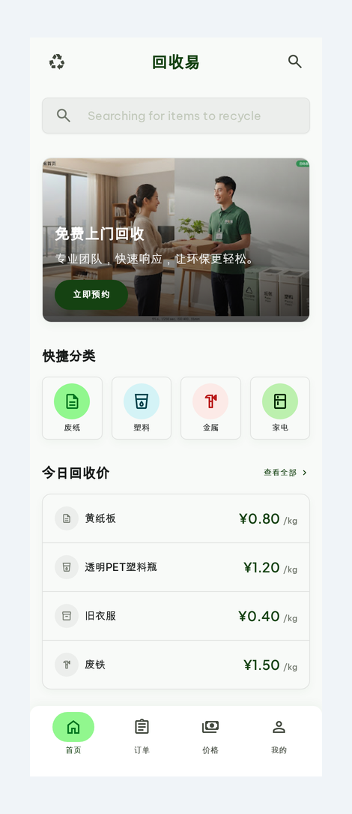

<div align="center">

# dsh-stitch-designer

**DeepSeek Harness（DSH）AI 设计插件 · Google Stitch 文字生成 UI · 会话内实时预览 · 1:1 HTML 导出**

在 [DeepSeek Harness](https://github.com/deepseek-ai/deepseek-harness)（DSH）里用 [Google Stitch](https://stitch.withgoogle.com) 做 AI 界面设计：输入需求 → 自动生成高保真 UI 设计稿 → 会话内面板实时预览 → 对话迭代改稿 → 导出 1:1 成品页面（可打包 EXE）。

[](LICENSE)
[](https://github.com/topics/dsh-plugin)
[]()
[]()

</div>

---

## ✨ 功能特性

| 能力 | 说明 |
|---|---|
| 🎨 文字生成设计 | 输入需求 → Google Stitch 生成高清 UI 设计稿（免费额度：每日 400） |
| 📱 多形态支持 | `MOBILE`（APP / 小程序）· `DESKTOP`（Web / 桌面软件界面）· `TABLET` · `AGNOSTIC` |
| 🖥 会话内预览 | 会话标题栏「AI 设计」按钮 → 弹出面板实时显示设计预览图（高清原图） |
| 💬 对话迭代 | 直接说"哪里要改" → AI 调用 Stitch 编辑 → 预览图自动更新 |
| 📦 1:1 导出 | 确定版后导出完整 HTML 成品（Tailwind，可运行 / 部署 / Electron·Tauri 打包 EXE） |
| 🔗 网页同步 | 同账号打开 stitch.withgoogle.com 可实时查看 / 手动微调（可选） |

## 📸 演示



*Stitch 生成的移动端设计稿（示例），会话内面板会实时展示类似效果。*

## 📦 安装（人类）

```bash
# 1. 克隆
git clone https://github.com/liuxinlongwa-hue/dsh-stitch-designer.git
cd dsh-stitch-designer

# 2. 一键安装（自动复制插件 + 写入 DSH 组合配置）
bash install.sh

# 3. 准备 Stitch API key（免费，每日 400 额度）
#    a. 打开 https://stitch.withgoogle.com 并登录
#    b. 头像 → Stitch Settings → API key → Create key
#    c. 保存完整 key（AQ. 开头）：
#       echo 'AQ.你的key' > ~/.stitch/key && chmod 600 ~/.stitch/key

# 4. 重启 DSH（dsh web），会话标题栏出现「AI 设计」按钮即成功
```

## 🤖 安装（AI / Agent）

把本仓库链接发给你的 AI（如 Claude / DeepSeek / Codex），AI 阅读本文件后即可自动配置：

1. **安装插件**：将 `plugin.js` / `client.js` / `package.json` 放入 DSH profile 的 node_modules：
   `${DSH_HOME:-$HOME/.dsh}/profiles/web/node_modules/stitch-designer/`
2. **建符号链接**：在 npx 缓存 node_modules（DSH 实际安装位置，如 `~/.npm/_npx/<hash>/node_modules/`）执行：
   `ln -sfn <上述目录> <npx缓存>/stitch-designer`
   （DSH loader 用 `import('stitch-designer')` 从自身位置解析；client-modules 用 `createRequire(profile目录)` 解析——两端都要命中。）
3. **写组合配置**：在 `cordis.patch.yml` 追加：
   ```yaml
   - insert:
       - id: stitch-designer
         name: 'stitch-designer'
   ```
4. **配置 API key**：指导用户到 https://stitch.withgoogle.com → Stitch Settings → API key → Create key 获取免费 key（`AQ.` 开头），保存到 `~/.stitch/key`（权限 600）。
5. **重启 DSH**，验证会话标题栏出现「AI 设计」按钮。
6. **使用**：用户提设计需求 → 调 `POST /stitch/api/generate`（`{prompt, deviceType}`）→ 生成约 1-2 分钟（异步，用 `list_screens` 轮询）→ 面板显示 `/stitch/screens/{id}.png` 高清预览 → 用户提意见 → `POST /stitch/api/edit`（`{screenName, prompt}`）→ 满意后 `POST /stitch/api/html/{screenId}` 导出 1:1 HTML。

## 🔌 插件 API（Host 路由）

| 方法 | 路径 | 说明 |
|---|---|---|
| GET | `/stitch/api/state` | 项目 + 屏幕列表（含高清预览 URL，缺失自动下载） |
| POST | `/stitch/api/generate` | `{prompt, deviceType}` 生成设计 |
| POST | `/stitch/api/edit` | `{screenName, prompt}` 编辑改稿 |
| GET | `/stitch/api/html/{screenId}` | 导出 1:1 HTML 成品 |
| GET | `/stitch/screens/{id}.png` | 高清预览图（本地缓存） |
| GET | `/stitch/html/{id}.html` | HTML 成品页面 |

> 高清截图：Stitch 返回的 `screenshot.downloadUrl` 是缩略图，插件自动加 **`=s0`** 参数取原始分辨率。
> 默认项目：`5188527734101747624`（可在 `plugin.js` 的 `DEFAULT_PROJECT` 修改）。

## 🛠 工作原理

- **Host 端**（`plugin.js`，Node）：直接调用 Stitch 官方 MCP HTTP API（`stitch.googleapis.com/mcp` + `X-Goog-Api-Key`），负责生成 / 编辑 / 列表 / 截图缓存 / HTML 导出。不依赖 DSH 的 mcp-client，独立可用。
- **Client 端**（`client.js`，浏览器 bundle）：`__ModuleLoader__.load` 格式，在会话头部 Slot 注册「AI 设计」面板，实时拉取预览图。
- 无构建链，纯手写 bundle；改动后重启 DSH 生效。

## 🗺 路线图 / 其他

- 更多设备形态、多屏幕流程、`generate_variants` 变体对比
- 中文 / 英文 README 双语维护

## 🔒 安全

- API key 存于 `~/.stitch/key`（600 权限），**不硬编码、不进入仓库**。
- 请勿把 key 提交到任何公开仓库。

## 📄 License

[MIT](LICENSE) © 2026 liuxinlongwa-hue
